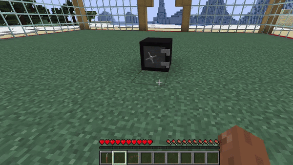

# Safes

## Functionalities

Explanation of basics Safes functionalities

### Overview

In robbing it is possible to use safes that players can use to take care of their items and enjoy to crack.\
All safes can be free and usable like a normal double check, or locked and protected by a pin.\
To lock or unlock a safe the player can use the following commands while looking to a safe.

* [`/rb lock <pin>`](../commands.md#rb-lock-less-than-pin-greater-than)
* [`/rb unlock <pin>`](../commands.md#rb-unlock-less-than-pin-greater-than)

<figure><figcaption></figcaption></figure>

### Cracking a safe

To crack a safe lockpicks must be used, clicking on a valid safe with a lockpick in main hand will show a gui with some white items named "**cylinder**", clicking on it will show the real color of the cylinder. There are 2 types of cylinders: **correct cylinder** and **wrog cylinder**. To successfully crack the safe you have to find the **correct cylinder**.

Mistaking the cylinder 2 times will mean breaking the lockpick, and it will be necessary to use another one.

Once the correct cylinder is found the safe inventory will be shown.

### Get items

Is possible get safe or lockpick using the commands:

`/rb give <player> safe`\
`/rb give <player> lockpick`

Is also possible to craft it. All the items recipes are customizable from a gui using the command:

`/rb menu`

Default recipes:

<figure><figcaption></figcaption></figure>

<figure><figcaption></figcaption></figure>

**Note**: to craft an item the permission `robbing.craft.<item_name>` is required.
